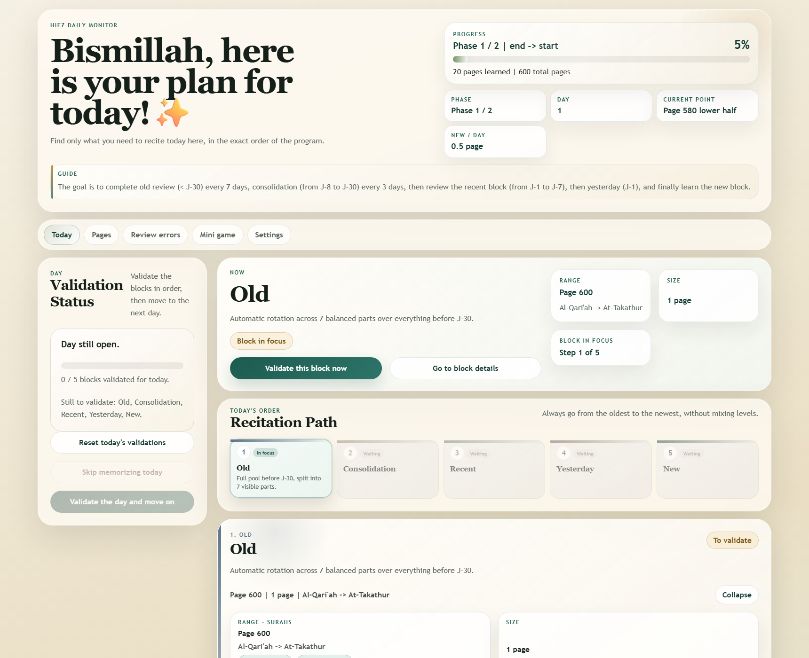
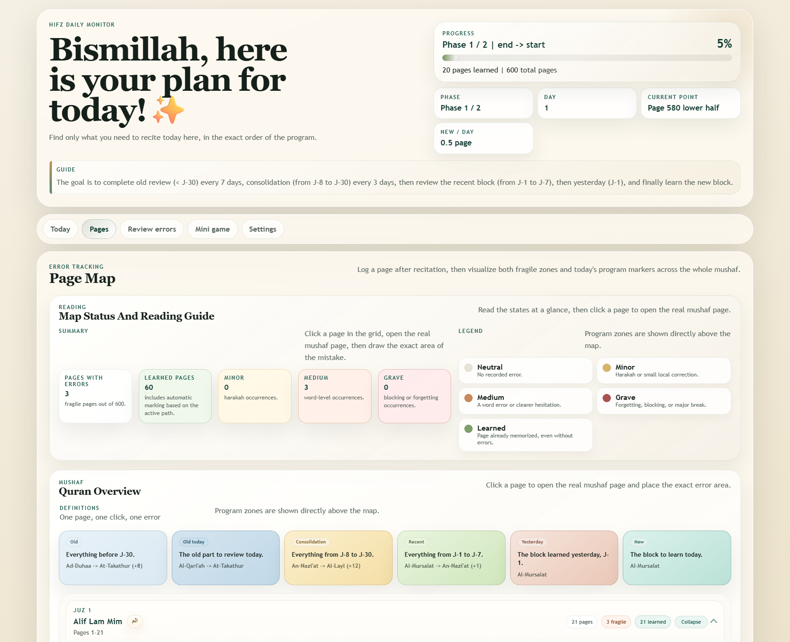
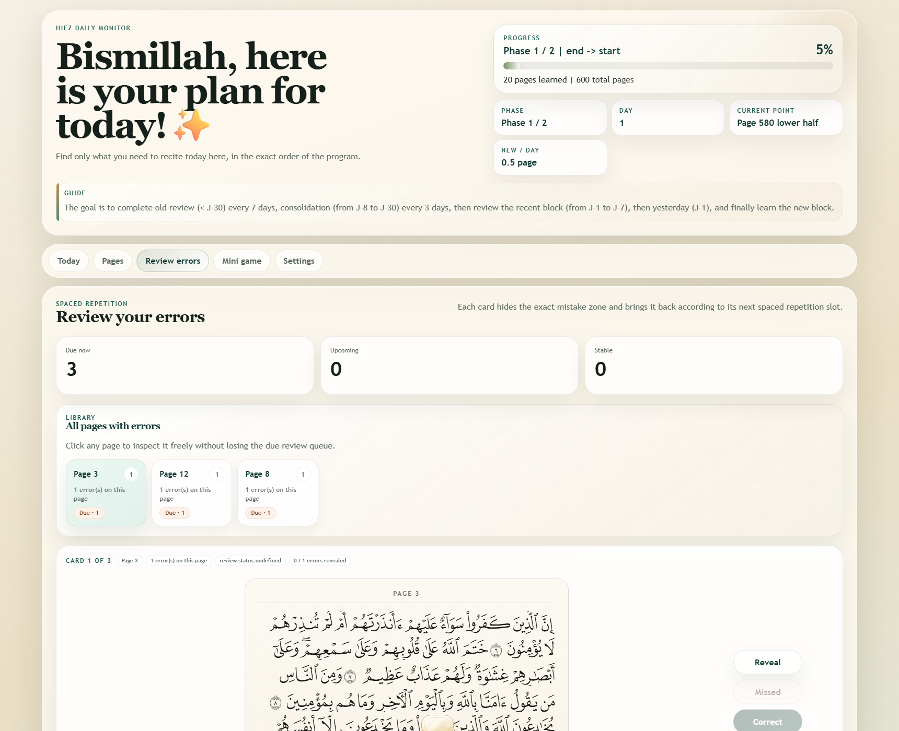
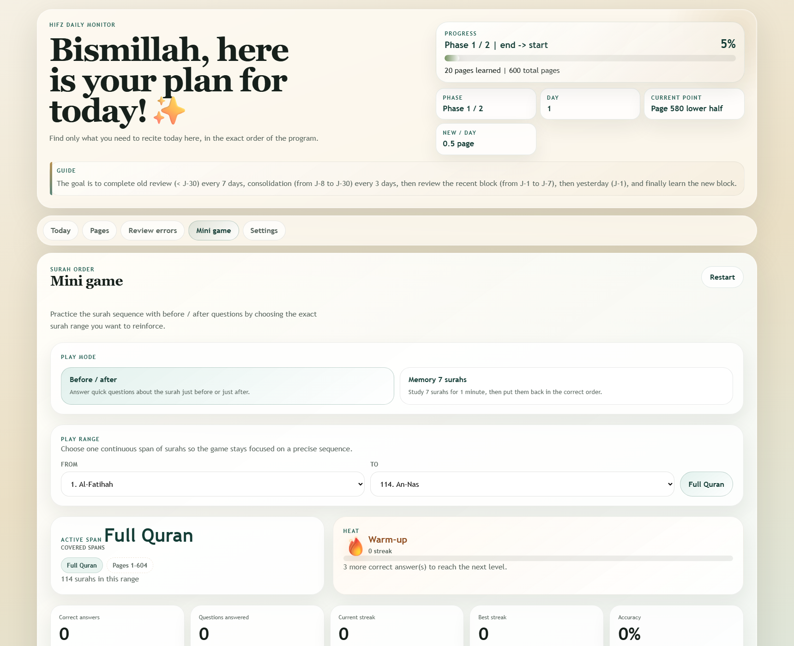
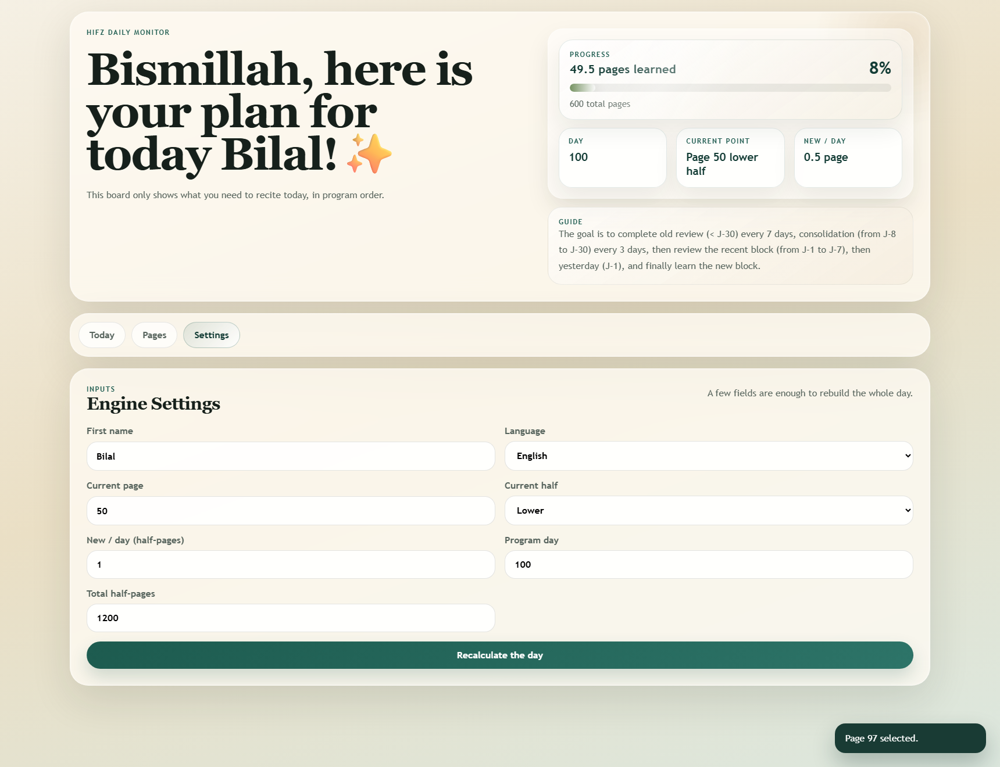

# Hifz Daily Monitor

French version: [README.md](README.md)

Local daily monitoring app for hifz.

It does not memorize for you. It structures the day, tracks progress, lets you place mistakes on real Madinah mushaf pages, and then brings those mistakes back with spaced repetition.

## What the app handles

- strict daily order:
  1. `Old`
  2. `Consolidation`
  3. `Recent`
  4. `Yesterday`
  5. `New`
- `New` block split into `3 waves` with `3 checks` each
- configurable program paths:
  1. `Start -> end`
  2. `End -> start`
  3. `End -> start then start -> end`
- dual-pass progress with separate counters per phase
- day closure without new memorization through `Do not memorize anything today`
- Quran page map grouped by `juz`, collapsible, with states, surah names, and program zones
- `real page` editor to place mistakes precisely on Madinah mushaf pages
- error types: `Harakahs`, `Word`, `Whole line`, `Next page link`
- error review powered by `FSRS`, with progressive reveal and a full fragile-page library
- surah order mini-game with:
  - `Before / after` mode
  - `Memorize 7 surahs` mode
  - streaks, flame tiers, milestones, and configurable surah ranges

## Required inputs

- `Current page`
- `Current half`
- `Program path`
- `Current phase`
- `New / day (in half-pages)`
- `Program day`
- `Total half-pages`
- `Language`: French or English

## What the app shows

- today's `Old` block with automatic rotation across `7 parts`
- `J-8 -> J-30` consolidation split into `3 parts`
- the `J-1 -> J-7` recent block
- the `Yesterday` block (`J-1`)
- today's `New` block with its `9 checks`
- a compact Quran page map grouped by `juz`
- surah names and program markers directly inside the grid
- focused error review with masks and spaced repetition

## Screenshots

### Today View



### Pages View



### Review Errors View



### Mini Game View



### Settings View



## Run the app

```powershell
node src/server.js
```

Then open [http://127.0.0.1:3100](http://127.0.0.1:3100).

## Mobile with Capacitor

The Capacitor base is now in place with:

- root config: `capacitor.config.json`
- native Android project: `android/`
- bundled web assets from: `public/`

The mobile app relies on `public/browser-local-api.js`, so it can keep using `/api/*` routes without starting a Node server inside the native shell.

Useful commands:

```powershell
npm run cap:sync
npm run build:android-assets
npm run android:assemble:debug
npm run android:assemble:release
npm run android:bundle:release
npm run android:keystore:generate
npm run android:devices
npm run android:install:debug
npm run android:studio
npm run cap:open:android
npm run cap:run:android
```

Android prerequisites:

- Android Studio
- JDK 21 for this Capacitor stack

The project can also build locally with the project-scoped JDK 21 and Android SDK:

```powershell
npm run android:assemble:debug
```

To prepare real release signing:

1. Run `npm run android:keystore:generate`
2. This creates a local keystore in `.keystore/` and an `android/keystore.properties` file
3. Then run `npm run android:assemble:release` or `npm run android:bundle:release`

For iOS, continue on macOS, then add the platform with `@capacitor/ios` and `npx cap add ios`.

## Storage

Local state is stored in:

- `data/state.json`

There is no SQL database and no external engine: just a local, readable workflow built for a daily hifz routine.
