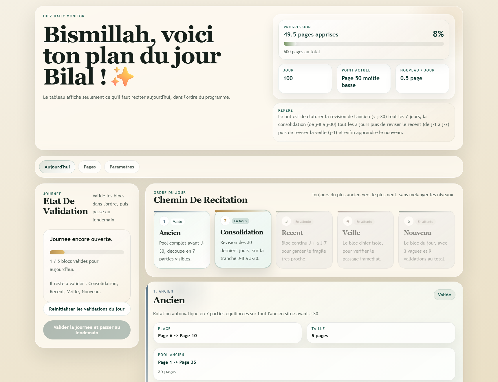
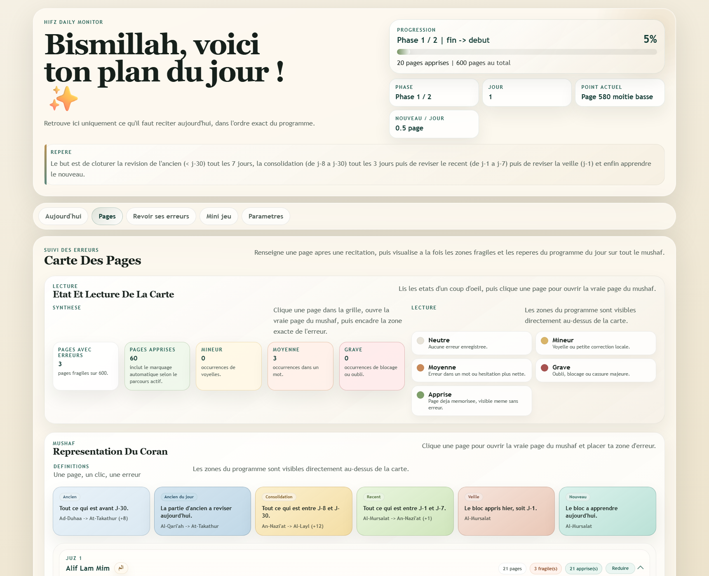
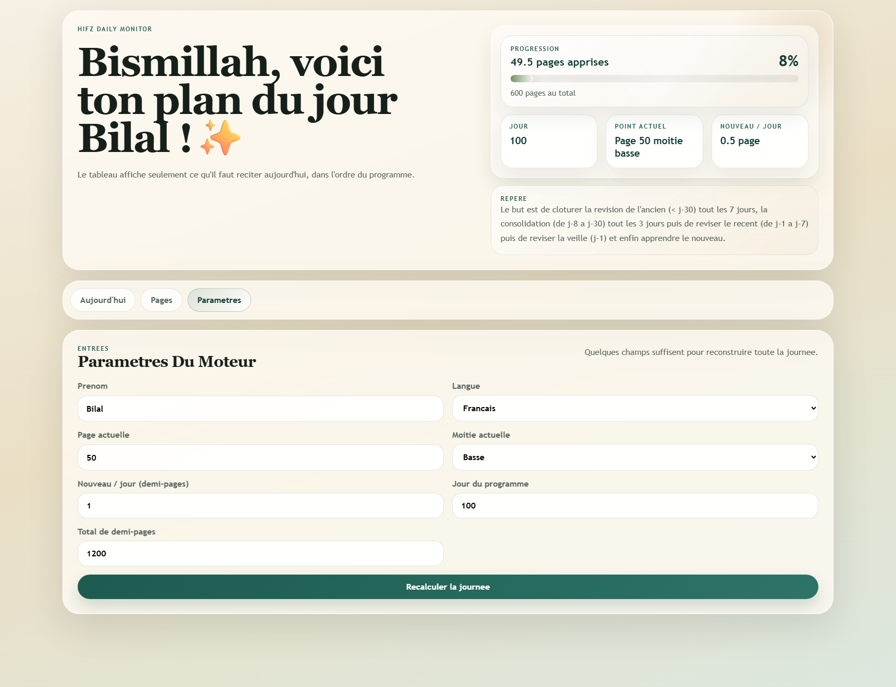

# Hifz Daily Monitor

Version anglaise : [README.en.md](README.en.md)

Application locale de monitoring quotidien pour le hifz.

Elle ne memorise pas a ta place. Elle organise la journee, suit la progression, trace les erreurs sur de vraies pages du mushaf de Medine, puis repropose ces erreurs avec une repetition espacee.

## Ce que l'application gere

- plan du jour en ordre strict :
  1. `Ancien`
  2. `Consolidation`
  3. `Recent`
  4. `Veille`
  5. `Nouveau`
- bloc `Nouveau` en `3 vagues` de `3 validations`
- parcours configurables :
  1. `Debut -> fin`
  2. `Fin -> debut`
  3. `Fin -> debut puis debut -> fin`
- progression double avec compteurs separes par phase
- journee cloturee sans nouveau avec `Ne rien memoriser aujourd'hui`
- carte des pages regroupee par `juz`, reductible, avec etats, sourates et zones du programme
- editeur `page reelle` pour placer une erreur exactement sur la page du Quran de Medine
- types d'erreurs : `Harakats`, `Mot`, `Ligne entiere`, `Liaison page suivante`
- revue des erreurs avec `FSRS`, revele progressif des masques et bibliotheque de toutes les pages fragiles
- mini-jeu sur l'ordre des sourates avec :
  - mode `Avant / apres`
  - mode `Memo 7 sourates`
  - serie, flammes, paliers et plage de sourates configurable

## Ce que l'app prend en entree

- `Page actuelle`
- `Moitie actuelle`
- `Parcours`
- `Phase actuelle`
- `Nouveau / jour (en demi-pages)`
- `Jour du programme`
- `Total de demi-pages`
- `Langue` : francais ou anglais

## Ce que l'app montre

- le bloc d'ancien du jour, sur un roulement automatique en `7 parties`
- la consolidation `J-8 -> J-30`, decoupee en `3 parties`
- le recent `J-1 -> J-7`
- la veille `J-1`
- le nouveau du jour avec ses `9 validations`
- une carte compacte des pages du Coran avec regroupement par `juz`
- les noms de sourates et les reperes de programme directement sur la grille
- une revue ciblee des erreurs avec masques et rappel espace

## Captures

### Vue Aujourd'hui



### Vue Pages



### Vue Revoir Ses Erreurs


### Vue Mini Jeu


### Vue Parametres



## Lancer l'app

```powershell
node src/server.js
```

Puis ouvre [http://127.0.0.1:3100](http://127.0.0.1:3100).

## Mobile avec Capacitor

Le socle Capacitor est en place avec :

- config racine : `capacitor.config.json`
- projet Android natif : `android/`
- web embarque depuis : `public/`

L'app mobile s'appuie sur `public/browser-local-api.js`, donc elle peut continuer a utiliser les routes `/api/*` sans lancer un serveur Node dans le natif.

Commandes utiles :

```powershell
npm run cap:sync
npm run build:android-assets
npm run android:assemble:debug
npm run android:assemble:release
npm run android:bundle:release
npm run android:keystore:generate
npm run android:devices
npm run android:install:debug
npm run android:studio
npm run cap:open:android
npm run cap:run:android
```

Prerequis Android :

- Android Studio
- JDK 21 pour cette stack Capacitor

Le projet peut aussi compiler en local avec la JDK 21 et le SDK Android installes dans le dossier du projet :

```powershell
npm run android:assemble:debug
```

Pour preparer une vraie signature release :

1. Lance `npm run android:keystore:generate`
2. Cela cree un keystore local dans `.keystore/` et un fichier `android/keystore.properties`
3. Ensuite tu peux lancer `npm run android:assemble:release` ou `npm run android:bundle:release`

Pour iOS, il faudra lancer la suite sur macOS, puis ajouter la plateforme avec `@capacitor/ios` et `npx cap add ios`.

## Stockage

L'etat local est garde dans :

- `data/state.json`

Il n'y a pas de base SQL ni de moteur externe : seulement un suivi local, lisible, et pense pour une routine quotidienne de hifz.
